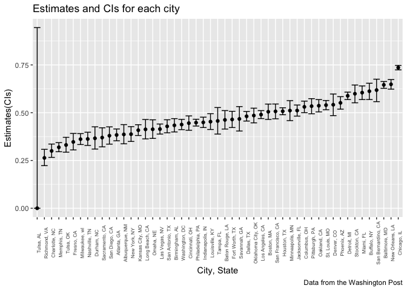

p8105\_hw5\_zw2541
================
Zixu\_Wang
11/4/2018

Problem 1
---------

### Read and clean the data

Create a tidy dataframe containing data from all participants, including the subject ID, arm, and observations over time.

``` r
files = as.data.frame(list.files(path = "./data_1")) 
colnames(files)[1] = "file_names"
  
read_and_tidy = function(file_names){
     read.csv(str_c("./data_1/", file_names)) 
}

study_data =
  files %>% 
  mutate(map(files$file_names, read_and_tidy)) %>% 
  unnest() %>% 
  janitor::clean_names() %>% 
  rename(group = file_names) %>% 
  gather(key = week, value = data, week_1:week_8) %>% 
  mutate(group = str_replace(group, ".csv", "")) %>% 
  separate(group, into = c("group", "id"), sep = "_") %>% 
  mutate(week = str_replace(week, "week_", ""))
```

### Spaghetti plot

Make a spaghetti plot showing observations on each subject over time, and comment on differences between groups.

``` r
study_data %>%
  ggplot(aes(x = as.numeric(week), y = data, color = id)) +
  geom_line() +
  facet_grid(~ group) +
  labs(
    title = "Observations on Each Subject over Time",
    x = "Week",
    y = "Value",
    caption = "Data from a longitudinal study") +
  theme(legend.position = "bottom")
```


At the beginning of the experiment, the mean of the value of control group is 0.915, and the mean of the value of experiment group is 1.141, which are almost the same. However, the value of the experiment group significantly increased over this 8-weeks study, whereas the control group didn't change a lot (actually decreased a little bit). At the end of this study, the mean value of the control group is 0.74, and the mean value of the experiment group is 5.119.

Problem 2
---------

### Read and clean the data

``` r
homicides_data = 
  read.csv("./data_2/homicide-data.csv") %>% 
  janitor::clean_names() 
```

### Describe the raw data

This dataset describes the situation of homicides in 50 large U.S. cities. It contains 52179 observations and 12 variables. These variables indicate the name, race, age, sex, living city and state, latitude and longitude of the position and disposition of each victim.

Create a city\_state variable (e.g. "Baltimore, MD") and then summarize within cities to obtain the total number of homicides and the number of unsolved homicides (those for which the disposition is "Closed without arrest" or "Open/No arrest").

``` r
summarize_homicides = 
  homicides_data %>% 
  mutate(city_state = str_c(city, state, sep = ", ")) %>% 
  select(-city, -state) %>% 
  group_by(city_state) %>% 
  summarize(n_homicides = n(),
            n_unsolved_homicides = sum(disposition %in% c("Closed without arrest", "Open/No arrest")))

summarize_homicides
```

    ## # A tibble: 51 x 3
    ##    city_state      n_homicides n_unsolved_homicides
    ##    <chr>                 <int>                <int>
    ##  1 Albuquerque, NM         378                  146
    ##  2 Atlanta, GA             973                  373
    ##  3 Baltimore, MD          2827                 1825
    ##  4 Baton Rouge, LA         424                  196
    ##  5 Birmingham, AL          800                  347
    ##  6 Boston, MA              614                  310
    ##  7 Buffalo, NY             521                  319
    ##  8 Charlotte, NC           687                  206
    ##  9 Chicago, IL            5535                 4073
    ## 10 Cincinnati, OH          694                  309
    ## # ... with 41 more rows

### prop.test of Baltimore, MD

For the city of Baltimore, MD, use the prop.test function to estimate the proportion of homicides that are unsolved; save the output of prop.test as an R object, apply the broom::tidy to this object and pull the estimated proportion and confidence intervals from the resulting tidy dataframe.

``` r
baltimore =
  summarize_homicides %>% 
  filter(city_state == "Baltimore, MD") 

  prop.test(baltimore$n_unsolved_homicides, baltimore$n_homicides) %>% 
    broom::tidy() %>% 
    select(estimate, conf.low, conf.high)
```

    ## # A tibble: 1 x 3
    ##   estimate conf.low conf.high
    ##      <dbl>    <dbl>     <dbl>
    ## 1    0.646    0.628     0.663

The estimated proportion is 0.646 and confidence intervals is (0.628, 0.663).

### Run prop.test for each of the cities

``` r
test_result = map2(.x = summarize_homicides$n_unsolved_homicides, 
                  .y = summarize_homicides$n_homicides, 
                  ~prop.test(.x, .y))
```

    ## Warning in prop.test(.x, .y): Chi-squared approximation may be incorrect

``` r
pull_result = function(test_result){
  test_result %>% 
    broom::tidy() %>% 
    select(estimate, conf.low, conf.high)
}

tidy_result = map(.x = test_result, ~pull_result(.x)) %>% 
  bind_rows() %>% 
  mutate(city_state = summarize_homicides$city_state) %>% 
  select(city_state, everything()) %>% 
  mutate(city_state = forcats::fct_reorder(city_state,estimate))

tidy_result
```

    ## # A tibble: 51 x 4
    ##    city_state      estimate conf.low conf.high
    ##    <fct>              <dbl>    <dbl>     <dbl>
    ##  1 Albuquerque, NM    0.386    0.337     0.438
    ##  2 Atlanta, GA        0.383    0.353     0.415
    ##  3 Baltimore, MD      0.646    0.628     0.663
    ##  4 Baton Rouge, LA    0.462    0.414     0.511
    ##  5 Birmingham, AL     0.434    0.399     0.469
    ##  6 Boston, MA         0.505    0.465     0.545
    ##  7 Buffalo, NY        0.612    0.569     0.654
    ##  8 Charlotte, NC      0.300    0.266     0.336
    ##  9 Chicago, IL        0.736    0.724     0.747
    ## 10 Cincinnati, OH     0.445    0.408     0.483
    ## # ... with 41 more rows

### Create the plot of estimates and CIs for each city

``` r
tidy_result %>% 
  ggplot(aes(x = city_state, y = estimate)) + 
  geom_point() +
  geom_errorbar(aes(ymin = conf.low, ymax = conf.high)) +
  theme(axis.text.x = element_text(angle = 90, size = 6)) +
  labs(
    title = "Estimates and CIs for each city",
    x = "City, State",
    y = "Estimates(CIs)",
    caption = "Data from the Washington Post")
```


