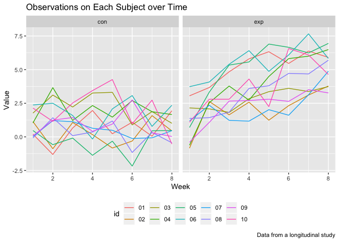

p8105\_hw5\_zw2541
================
Zixu\_Wang
11/4/2018

Problem 1
---------

### Read and clean the data

``` r
file_names = list.files(path = "./data_1")


read_and_tidy = function(file_names){
   a = read.csv(str_c("./data_1/", file_names)) %>% 
     janitor::clean_names() %>% 
     as.data.frame() %>% 
     mutate(group = file_names) %>% 
     select(group, everything())
}

study_data = map(file_names, read_and_tidy) %>% 
  bind_rows() %>% 
  gather(key = week, value = data, week_1:week_8) %>% 
  mutate(group = str_replace(group, ".csv", "")) %>% 
  separate(group, into = c("group", "id"), sep = "_") %>% 
  mutate(week = str_replace(week, "week_", ""))
```

### Spaghetti plot

``` r
study_data %>% 
  ggplot(aes(x = as.numeric(week), y = data, color = id)) +
  geom_line() +
  facet_grid(~ group) +
  labs(
    title = "Observations on Each Subject over Time",
    x = "Week",
    y = "Value",
    caption = "Data from a longitudinal study") +
  theme(legend.position = "bottom")
```


